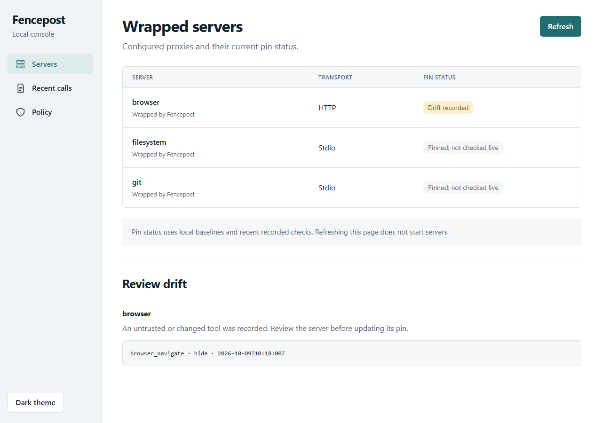
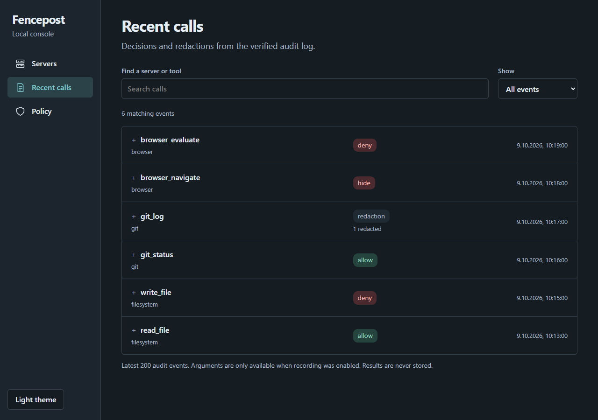
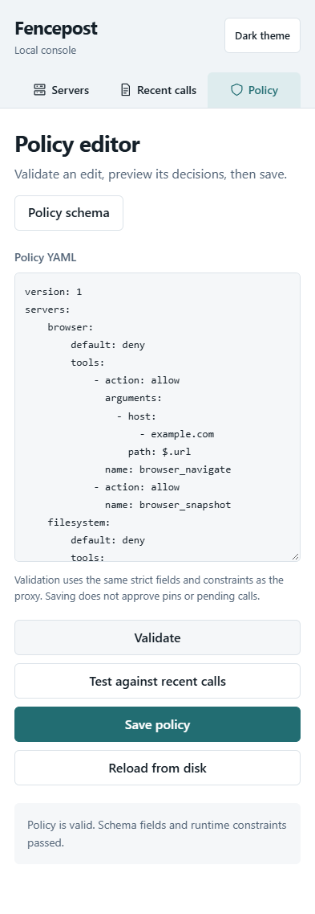

# Local console

```sh
fencepost ui --config ./mcp.json --policy fencepost.yaml --lock fencepost.lock
```

Open the private URL printed by the process; interrupt the process to stop it. The default is a random port on `127.0.0.1`; `--listen 127.0.0.1:8791` selects a fixed port. Hostnames/non-loopback addresses are rejected. All assets and the schema are embedded; no CDN, telemetry, internet access or frontend build is required.

The URL's random 256-bit token becomes a host-only HttpOnly SameSite=Strict session cookie, then is removed from the URL. Every asset/data route requires authentication. Host/Origin checks, same-origin JSON saves, CSP and no-store/no-referrer headers protect browser requests. Restart invalidates cookies. Other processes running as your user remain outside this boundary.

## Views

**Servers** shows client entries, wrapping, transport, baseline presence, launch drift and recent recorded pin denials. Original launch settings come from wrapper backups. Refresh never starts servers. “Pinned; not checked live” means a baseline exists, not a fresh verification. “Drift recorded” can be historical; run `verify` against the original config to check live definitions.

**Recent calls** filters decisions/redactions from the latest 200 verified audit events by server/tool, denies, redactions or allowed calls. Expand a row for its sanitized record. Chain/checkpoint failures return an error without showing unverified events. The selected policy supplies the audit path; this is not an aggregate of unrelated logs. Refresh in Servers reloads the snapshot.

**Policy** edits one local YAML file. Validate uses the same strict schema fields and runtime constraints as `policy check`; download the schema for external editors. Test against recent calls uses the existing replay matcher and current audit source, even if the draft changes that source. Only changed/unknown decisions are shown. Missing/redacted arguments produce unknown; counters, live pins and approvals are not simulated. No tool executes.

Save validates before atomic replacement and rejects a changed-on-disk file. Reload asks before discarding a draft. Directories, new files and symlinks cannot be saved. Restart standalone proxies after edits; gateway policy sources poll for changes. Audit destination changes still need a gateway restart.

## Screenshots and checks

Run `npm ci` then `make ui-test`. This requires Node.js 22+, Go and Playwright Chromium (`npx playwright install chromium`), or installed Microsoft Edge on Windows. The fixture builds the binary, creates synthetic configs/pins/audit records and drives real authenticated handlers without contacting the displayed servers.

The script captures all views at 1280×900 and 393×852 CSS pixels in both themes, plus denies, redactions, empty results, invalid policy and replay states. It checks navigation, filtering, themes, validation, replay, saves, page errors and horizontal overflow. All PNGs are in `docs/screens/`.






